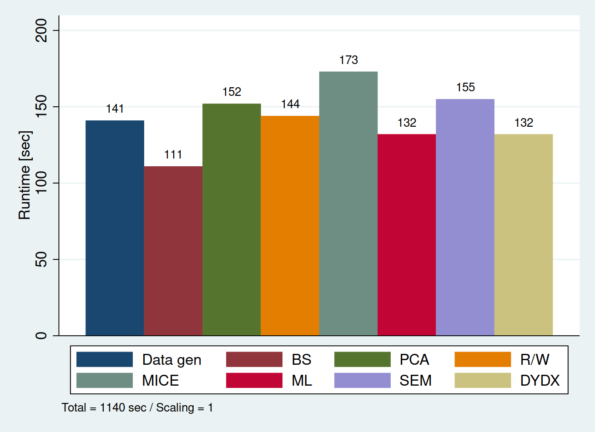

benchmark: Benchmarking Stata
======================================================================
_benchmark_ conducts a benchmark test to see how powerful your current system is. It computes eight of Stata's most relevant statistical methods. Estimated runtime is between 5 and 15 minutes on current systems (2024).

Installation
============

``` stata
. net install benchmark, from(https://raw.github.com/fbittmann/benchmark/stable) replace
```

Examples
========

Setup and minimal example
-------------------------
``` stata
benchmark, graph
```


Citation
============
Thanks for citing this software as follows:

> Bittmann, Felix (2024): benchmark: Benchmarking Stata. Available from: https://github.com/fbittmann/benchmark
